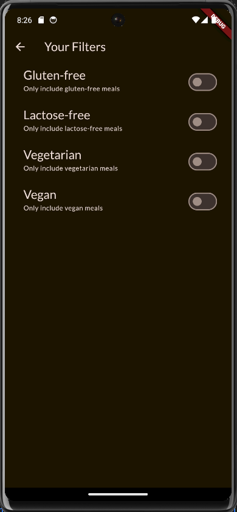
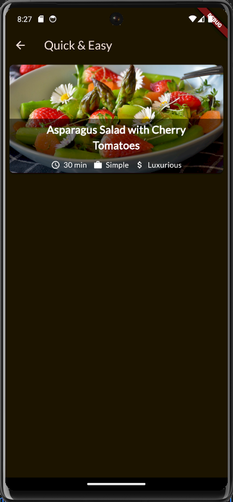

# meals_app

The construction of the Meals app marked an immersive journey through diverse aspects of Flutter, each contributing to the creation of a feature-rich and visually engaging application.

Navigation and Multi-screen Flutter Apps:
The app's architecture was meticulously designed to offer users a seamless navigation experience. The ability to explore meals, mark favorites, and view them under the Favorites tab showcased a sophisticated understanding of navigation in multi-screen Flutter apps. Essential concepts, such as pushing and popping screens onto and off the stack, were employed to ensure a smooth user journey. The significance of the Navigator object, along with methods like `push` and `push replacement`, played a pivotal role in managing the app's navigation flow, providing users with an intuitive and structured interface.

State Management with Riverpod:
Introduction to Riverpod brought a robust solution for managing global or cross-widget state within the app. The incorporation of dynamic providers and methods for altering values facilitated efficient sharing of state across different sections of the application. Setting up providers in the main.dart file, utilizing notifier classes for complex state changes, and employing the `ref` keyword to consume providers in widgets underscored the importance of effective state management in building scalable and maintainable Flutter applications.

Explicit Animations:
The exploration of explicit animations showcased a nuanced understanding of animation control in Flutter. The implementation of an animation controller allowed for manual configuration and control of animations. AnimatedBuilder was employed to animate specific elements within the widget tree, demonstrating the capability to animate padding and slide transitions. The use of Tween to define start and end values, along with curve configurations, showcased a granular level of control over animation dynamics.

Alternative Animation Techniques:
The consideration of alternative animation techniques demonstrated a pragmatic approach to animation implementation. The AnimatedSwitcher, enabling smooth transitions between different widgets through the use of a key, exemplified a simplified method for achieving visual effects. Additionally, the integration of rotation transitions enhanced the visual appeal of the meal details screen, providing users with a polished and delightful experience.

Hero Widget:
The deployment of the Hero widget showcased an advanced Flutter feature for creating cohesive and visually appealing transitions between screens. Its use in smoothly transitioning meal items from the meals screen to the meal details screen added a layer of sophistication, contributing to a seamless and enjoyable user interface.

The development of the Meals app not only resulted in a fully functional and visually appealing application but also served as an educational platform for mastering intricate concepts of navigation, state management, and animation in Flutter. The meticulous incorporation of these elements reflects a comprehensive understanding of Flutter's capabilities, emphasizing best practices for building complex and dynamic mobile applications.

Here are the screenshots of the app:

  
  
 
  
 
 

Here is the demo of the app:

[Watch the video](meals_app_video.mp4)

(You have to download the video to watch it)